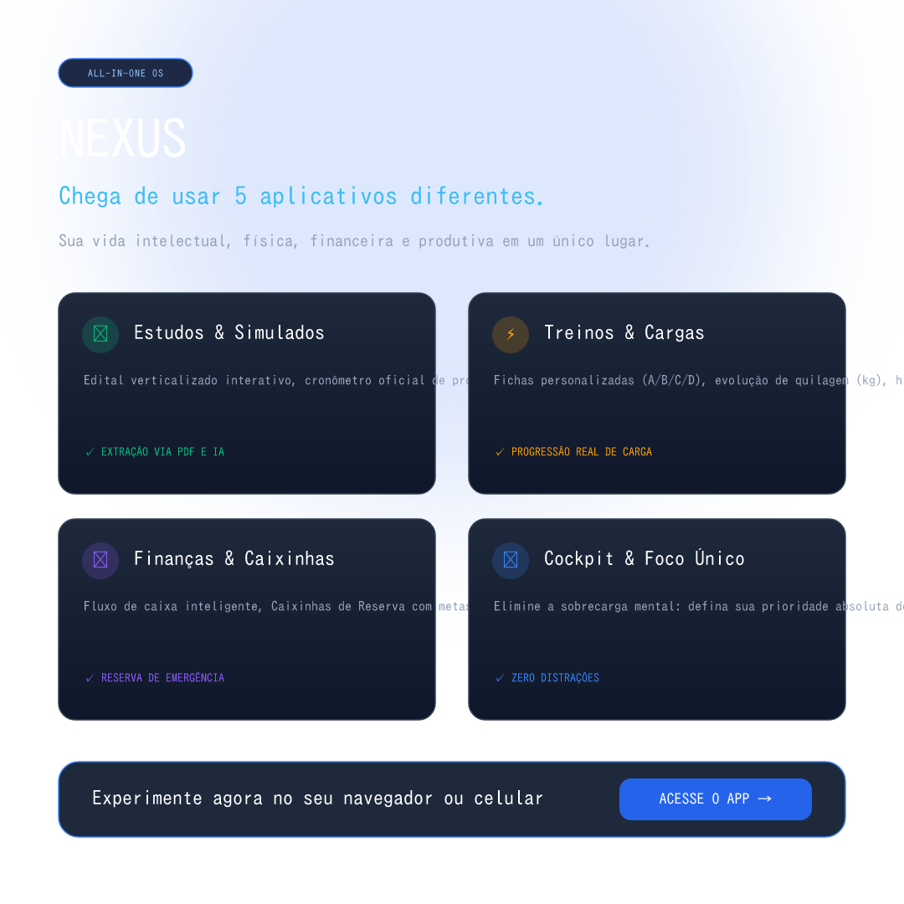
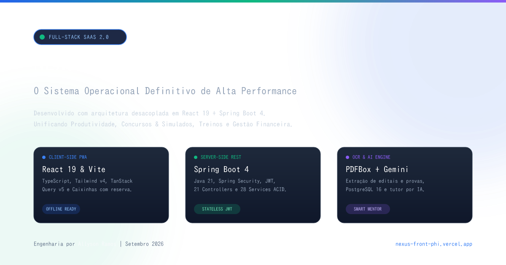
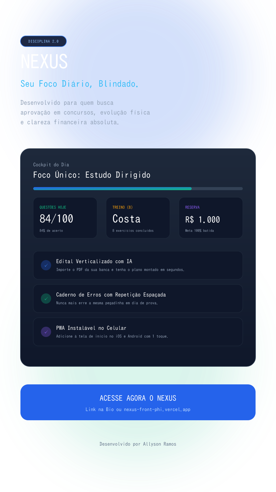

# 🚀 Nexus - Kit Oficial de Marketing & Redes Sociais

Pasta oficial contendo todas as imagens prontas em alta resolução (**PNG** e **SVG**), o dossiê da arquitetura em **PDF** e as legendas completas formatadas para publicação no **LinkedIn**, **Instagram** e **Stories/Reels**.

---

## 📸 1. Post para Feed do Instagram (Quadrado 1080 × 1080)

### 🖼️ Prévia da Imagem:


- **Arquivo PNG:** [`nexus-instagram-feed.png`](nexus-instagram-feed.png)
- **Arquivo SVG:** [`nexus-instagram-feed.svg`](nexus-instagram-feed.svg)

### 📝 Legenda Pronta para Copiar:
```text
Chega de usar 5 aplicativos diferentes para tentar organizar a sua vida. 🛑

Você anota o treino em um app, estuda para concurso em outro, controla o dinheiro numa planilha e perde o foco antes das 14h. A verdade é que a fragmentação drena a sua energia.

Por isso eu criei o NEXUS: seu ecossistema definitivo de alta performance em um só lugar.

Arrasta pro lado para ver o que tem dentro: 👉

📚 1. Estudos & Concursos de Elite:
Importe o PDF do seu edital e tenha a grade verticalizada na hora. Faça simulados cronometrados e alimente seu Caderno de Erros com repetição espaçada.

⚡ 2. Treinos & Progressão Real:
Fichas completas divididas (A/B/C/D), registro da carga levantada (kg), evolução corporal e histórico de pesagem.

💰 3. Finanças & Caixinhas de Reserva:
Controle de receitas e despesas com caixinhas separadas para sua reserva de emergência e objetivos futuros.

🎯 4. Cockpit de Foco Único:
Defina a prioridade absoluta do seu dia e execute no bloco de foco sem distrações.

📱 Funciona no computador e instala como aplicativo no seu celular (PWA).

🔗 Toque no link da minha bio para testar gratuitamente!

#produtividade #concursopublico #estudos #treino #financas #desenvolvimentopessoal #foco #nexus
```

---

## 💼 2. Banner para LinkedIn & Twitter (1200 × 630)

### 🖼️ Prévia da Imagem:


- **Arquivo PNG:** [`nexus-linkedin-launch.png`](nexus-linkedin-launch.png)
- **Arquivo SVG:** [`nexus-linkedin-launch.svg`](nexus-linkedin-launch.svg)

### 📝 Legenda Pronta para Copiar:
```text
🚀 Apresento o NEXUS: O Sistema Operacional de Alta Performance Pessoal e Intelectual.

Quantos apps diferentes você abre por dia para gerenciar sua rotina? A fragmentação cobra um preço alto em atenção e disciplina. Por isso, construí o Nexus — um ecossistema integrado projetado sob medida para quem busca aprovação em concursos de alto nível, progressão física e clareza financeira.

📐 Destaques de Arquitetura & Engenharia:
• Frontend PWA: React 19, Vite, Tailwind CSS e TanStack Query v5. Instalável no celular sem lojas de app e com suporte offline.
• Backend RESTful: Spring Boot 4 + Java 21, arquitetura limpa com 21 Controllers, 28 Services transacionais ACID e autenticação stateless JWT.
• Inteligência Artificial & OCR: Integração com Apache PDFBox e Gemini para ler editais em PDF e verticalizar assuntos automaticamente.
• Caderno de Erros Ativo: Motor de repetição espaçada e categorização por banca para blindar contra pegadinhas.
• Módulo de Finanças & Caixinhas: Gestão visual de fluxo de caixa com segregação de patrimônio e metas de reserva.

📄 Acesse a plataforma: https://nexus-front-phi.vercel.app
👉 Repositório: https://github.com/allysonramos-blibp/Nexus-front

#desenvolvimento #react #springboot #java #fullstack #saas #arquitetura #concursos #produtividade
```

---

## 📱 3. Story & Reels Vertical (1080 × 1920)

### 🖼️ Prévia da Imagem:


- **Arquivo PNG:** [`nexus-instagram-story.png`](nexus-instagram-story.png)
- **Arquivo SVG:** [`nexus-instagram-story.svg`](nexus-instagram-story.svg)

### 📝 Roteiro em 3 Telas:
```text
Tela 1 (Gancho/Enquete):
"Você ainda usa 3 a 5 apps diferentes para treino, estudos e dinheiro?"
[Sim, uma bagunça 😩] / [Preciso unificar urgente 🔥]

Tela 2 (A Solução):
"Eu cansei dessa fragmentação e programei o NEXUS:
✅ Edital verticalizado com IA a partir de PDF
✅ Caderno de Erros inteligente
✅ Fichas de treino com evolução de carga
✅ Caixinhas de reserva financeira"

Tela 3 (Chamada):
"Instale direto no seu celular em 5 segundos (sem baixar de loja). Link: https://nexus-front-phi.vercel.app"
```

---

## 📑 4. Documento Executivo de Arquitetura em PDF

- **Arquivo:** [`nexus-arquitetura-completa.pdf`](nexus-arquitetura-completa.pdf)
- Contém diagramas C4, especificações de endpoints REST, matriz de banco de dados e requisitos de segurança.
